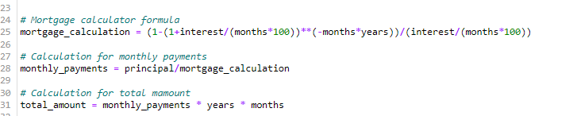
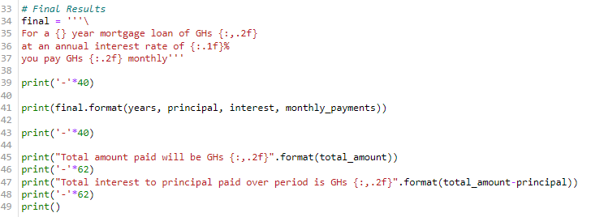

# *Mortgage-Calculator*
Creating a sample mortgage calculator 

## Below are the basic steps of creating a mortgage calculator

1. Initiate steps with a header.

2. Create key variables.

    Here we will declare all key variables. 

    - Principal - The principal loan amount taken.
    - Years - That is the tenure of mortgage loan.
    - Interest - This is the annual interest rate.
    - Months - The number of months in a year.

    

3. Using the key variables, create the syntax for all necessary calculations. 

    

4. Variable is created for the final results.

5. Print statement is created for all results. 

    - Total amount to be paid.
    - Total interest to principal paid over mortgage period.

    

 

